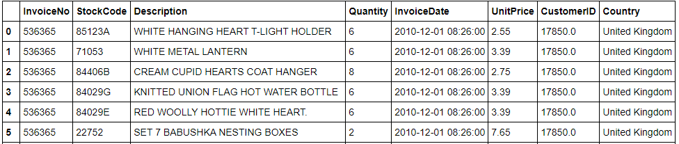
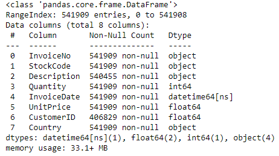
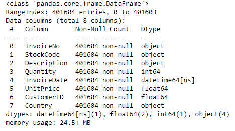

# Project1-customers_segmentation-RFM

The dataset contains several informations about customers transactions. Each customer has their own characteristic while doing a transaction, such as, loyal customers will spend a lot of money in single transaction because they got a lot of money or a student will spend as minimun money as they can in single transaction to save their money for living.
So thegoal of this project is to cluster the customers with the same characteristic while doing transaction. The clusters is based on RFM(recency, frequency, and monetary). So I hope that this project will help the decission maker to treat each cluster of customers differently to earn optimum profit.

First step for doing machine learning or any data science problem is to define WHAT QUESTION SHOULD I ANSWER FROM THIS PROJECT. So I define some questions that will be answered. The questions are
1. Which time and month has the best selling ?
2. How many cluster is the best ?
3. How's the characteristic of each cluster?
After that we can start analyzing the data and try to answer those questions.

The dataset contains 8 features and 541.909 rows, but there ara some missing and duplicate values on it

The dataset is not clean yet, so we have to clean up the data, such as, impute missing values, dropping duplicate rows, and split up **complete transaction** and **canceled transaction**

As you can see, no more missing values and the data is cleaned.

Next step is EDA (Exploratory Data Analysis).

We change InvoiceDate feature datatype into datetime and adding more features (Date-Month-Year, Month, Hour, Minute) in order to be calculated and make the analysis become easier.

So, we're able to know what time and month has the best selling. After we sum quantity x unit price, we got selling amount of each month and each time. Here the best selling month and time

November gives the company the biggest amount in year. Maybe november is time for holiday so the demand is increase.
12 PM is "rush hour", it gives the company the biggest amount in the day.
With those information, decision maker can decide his/her decision to increase the profit.

Now we start to cluster the all of the customers. But before that, we have to calculate **recency**, **frequency**, and **monetary**, we can calculate these three things with the following formula:
- Recency = Latest Date - Last Invoice Data
- Frequency = Count of InvoiceNo of Transaction
- Monetary = Sum of Total Payment

so, now we're have a new data that only contains **RFM**

Now let's start the clustering. Method that used is KMeans clustering. 
First, we define the number of K (number of clusters) with elbow method

After we got the number of K, now we can calculate the KMeans with K=3.
So we got 3 clusters ( cluster_0, cluster_1, and cluster_2)

Every cluster has following characteristic

**CONCLUSION**
So there are 3 different clusters (cluster_0, cluster_1, and cluster_2). As we can see, the most widely customers are in cluster_0. Even tough cluster_0 has the smallest number of frequency and monetary and the biggest number of recency(wich is really bad), but most of company income come from this cluster. So, we can under estimate this cluster. Cluster_1 and cluster_2 has better number of RFM tha cluster_0, but the sum of its customers are much less than cluster_0.
From this analysis, we can help Marketing Team to give a different 'treatment' for each clusters (segments).

